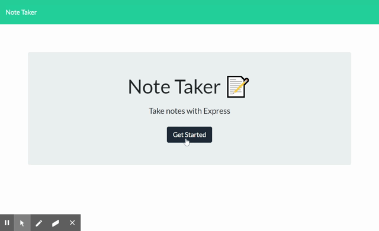

# Express-Note-Taker

(https://express-note-taker-sami.herokuapp.com/)

## Description
An express using application to write notes, and save them to a small api that can then be accessed later and delted when the note is no longer needed.

-used to test express coding, and heroku deployment.
-only the server.js file is written by me.
  
## Table Of Contents
* [Installation](#Installation)
* [Usage](#Usage)
* [Contributers](#Contributors)
* [Tests](#Tests)
* [License](#License)
* [Questions](#Questions)
  
## Usage
Used to take notes!
Click the pencil in the top right corner to create a new note. You can then fill out your note, then click the save icon next to the pencil to save it to access it later!
When you dont need a note anymore, you can then delete it from the left side of the application.
Happy note writing!
  
## Contributors
Sami Sully and Georgia Tech Bootcamp Students and Staff for teaching me to write this!

(https://www.github.com/SamiSully)

 HTML, CSS, BOOTSTRAP, JAVASCRIPT, NODE.JS, JQUERY, EXPRESS

  
## License
MIT License

(https://choosealicense.com/licenses/mit/)

Copyright © Sami Sully 2020
  
## Questions
If you have any questions, you can reach out to me directly at samilsully@gmail.com